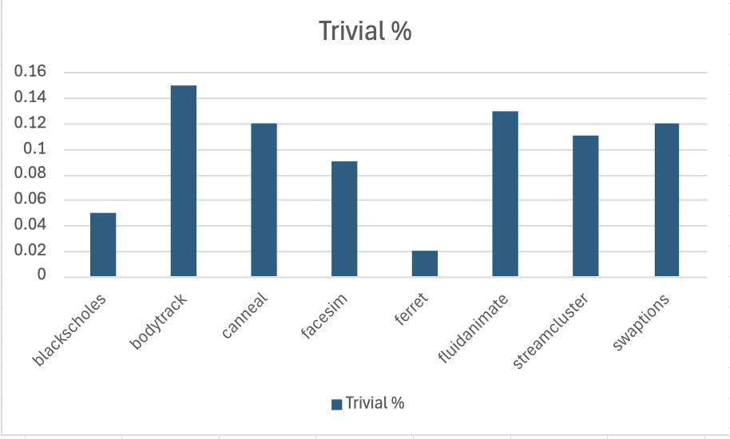
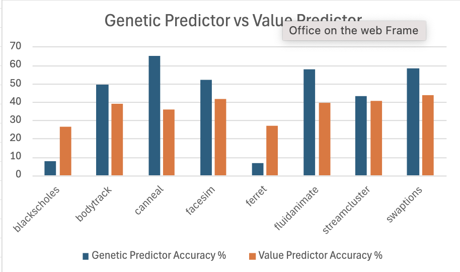

# Proiect la arhitecturi de calcul avansate
## Cuprins
**1. Introducere**
* 1.1 Tema
*  1.2 Scopuri si obiective
*  1.3 Plan

**2. Tehnologii** 
* 2.1 Multi2Sim
* 2.2 Parsec

**3. Rezolvarea Temei**
* 3.1 Configurare mediu de lucru
  * 3.1.1 Procesul de instalare Multi2Sim
  * 3.1.2 Procesul de instalare Parsec
* 3.2 Modificari aduse simulatorului Multi2Sim

**4. Rezultate si Concluzii** 

**5. Bibliografie**

## 1. Introducere
## Tema 
 Implementarea unor structuri care să determine gradul de reutilizabilitate al instrucţiunilor (ALU, Load), procentajul de instrucţiuni triviale din benchmark-urile SPEC 2000 (INT / FP). Dezvoltarea unei arhitecturi superscalare şi cu multithreading simultan îmbogăţită cu un mecanism de anticipare selectivă a valorilor instrucţiunilor cu latenţă ridicată de execuţie. Arhitectura propusă include o schemă de reutilizare a rezultatelor instrucţiunilor de înmulţire / împărţire. Cuantificaţi câştigul de performanţă de procesare astfel obţinut. Utilizati algorimti genetici

## Scop si obiective
**Scop** 

Extinderea unui simulator pentru a facilita datele de care avem nevoie pentru rezolvarea temei, realizarea simularilor si interpretarea rezultatelor

**Obiective**

* **1: Instructiuni Triviale**
  * identificarea instructiunilor triviale
  * contorizare
  * calcularea procentului de instructiuni triviale
  * afisarea contorului si a procentului 
* **2: Gradul de reutilizabilitate al instructiunilor ALU si Load**
  * identificarea instructiunilor ALU si Load
  * contorizarea intructiunilor ALU si Load (atat numarul total, cat si cel al instructiunilor reutilizate)
  * calcularea gradului de reutilizabilitate
  * afisarea contorului si a procentului de instructiuni reutilizate 
* **3: Value Predictor**
  * crearea unui Prediction Table
  * predictie
  * update
* **4 Algoritm genetic**
    * Stabilirea unei configuratii initiale
    * Structura individului
    * Initializare populatie
    * Calcul fitness        
    * Functiile de crossover si muatatie
    * Actualizare populatie 
* **5 Cuantificarea rezultatelor**
  * Realizarea simularilor 
  * Extragerea datelor 
  * Evidentierea rezultatelor

## 2. Tehnologii
## Multi2Sim


Multi2Sim este un simulator open-source utilizat pentru cercetare in arhitectura calculatoarelor. Permite simularea detaliata a procesoarelor superscalare si a mai multor sisteme. Este folosit special in mediul academic pentru evaluarea performantei diverselor arhitecturi si tehnici de optimizare.

Acesta este un simulator cycle-by-cycle capabil sa simuleze in detaliu:
 * Procesoare x86 (cu pipeline superscalar, cu executie out-of-order, predictie de ramificatii. cache-uri, etc.)
 * Procesoare ARM 
 * Sisteme multi-core si multi-threaded
 
 Este scris in C si C++, fiind foarte modular pentru a permite extinderea usoara cu noi componente.

 Principalele fisiere folosite in simularea procesoarelor x86 sunt:

| Fisier | Rol |
|--------|-----|
| `alu.cc` | Simulează executia instructiunilor aritmetice/logice. |
| `exec.cc` | Coordonatorul executiei – decide ce unitate functionala primeste fiecare instructiune. |
| `fetch.cc` | Simulează etapa de **fetch** din pipeline – aduce instructiunile din memorie. |
| `decode.cc` | Decodează instructiunea si o pregateste pentru executie. |
| `rename.cc` | Implementarea **register renaming** pentru executie out-of-order. |
| `issue.cc` | Emite instructiunile catre unitatile functionale disponibile. |
| `commit.cc` | Commit-ul instructiunilor (scrierea rezultatelor in arhitectura finala). |
| `thread.cc` | Coordonarea executiei firului (threadului) de executie. |
| `core.cc` | Definirea nucleului (core) x86 – instantiaza componentele. |
| `insn.cc` | Structura de date pentru o instructiune – folosita in toate etapele pipeline-ului. |

## PARSEC (Princeton Application Repository for Shared-Memory Computers)


Parsec este un **benchmark suite** dezvoltat de Universitatea Princeton pentru a evalua performanta sistemelor multi-core si multi-threaded. Este extrem de folosit in cercetarea academica si industriala pentru testarea simulatoarelor de procesoare. (M2S)

Acesta este distribuit ca o suita de aplicatii/benchmark-uri impartite in domenii diferite. (ex:media, AI, etc.) 

| Benchmark       | Descriere                                              | Tip workload                    | Domeniu             |
|-----------------|---------------------------------------------------------|----------------------------------|---------------------|
| **blackscholes** | Calcule financiare pentru optiuni folosind metoda Black-Scholes. | CPU-bound, matematic intensiv   | Finance             |
| **bodytrack**    | Urmarirea miscarii corpului uman dintr-un set de imagini video. | Media, procesare imagine        | Computer Vision     |
| **canneal**      | Optimizare layout circuite folosind simulated annealing. | Memorie intensiva               | EDA (VLSI Design)   |
| **dedup**        | Compresie cu eliminare de duplicat.                     | I/O si memorie intensiv         | Data Compression    |
| **facesim**      | Simulare expresii faciale realiste.                    | CPU si memorie                  | Graphics / Animation|
| **ferret**       | Cautare de imagini similara prin AI.                   | Multi-threaded, AI              | AI / Image Search   |
| **fluidanimate** | Simulare fizica de fluide.                             | CPU-bound, compute-intensive    | Physics Simulation  |
| **freqmine**     | Extrage pattern-uri frecvente din seturi de date.      | Big data / datamining           | Data Mining         |
| **raytrace**     | Randare scene 3D cu ray tracing.                       | Compute si cache-intensive      | Graphics / Rendering|
| **streamcluster**| Clustering de fluxuri de date in timp real.           | Data mining, parallel           | Online Clustering   |
| **swaptions**    | Evaluare financiara prin Monte Carlo.                 | Numerice, paralelizare buna     | Finance             |
| **vips**         | Procesare de imagini.                                  | Cache si memorie                | Image Processing    |

## 3. Rezolvarea temei
### Mediu de Dezvoltare
Pentru realizarea temei am folosit un sistem cu dual boot Windows 11 si Linux, configurat cu GRUB pentru alegerea sistemului de operare la pornire. Aceasta configurare a permis:
- Dezvoltarea codului in Linux pentru compatibilitate optima cu Multi2Sim
- Testarea si documentarea in Windows pentru acces la instrumente de productivitate
- Tranzitie usoara intre sisteme pentru diferite faze ale proiectului

### Procesul de Instalare Multi2Sim
Multi2Sim a fost descarcat din documentatia oficiala [Multi2Sim](http://www.multi2sim.org/). Procesul de instalare a constat in:

1. **Dezarhivare**
   - Extragerea arhivei Multi2Sim in directorul dorit
   - Accesarea directorului de instalare

2. **Configurare si Compilare**
   ```bash
   cd multi2sim
   ./configure
   sudo make install   
   make
   ```
   - Comanda `./configure` verifica dependentele si pregateste sistemul pentru compilare
   - Comanda `make` compileaza sursele si creeaza executabilul

3. **Rezolvare Eroare de Compilare**

   - In versiunea oficiala exista o eroare de compilare care trebuie rezolvata
   - Se acceseaza fisierul `/multi2sim5.0/scr/arch/southern-islands/emulator/WorkItemIsa.cc`
   - Se inlocuieste linia:
     ```cpp
     else if (isnan(fvalue) || fvalue == 0.0f || fvalue == -0.0f)
     ```
     cu:
     ```cpp
     else if (std::isnan(fvalue) || fvalue == 0.0f || fvalue == -0.0f)
     ```
   - Aceasta modificare adauga namespace-ul `std::` pentru functia `isnan`

4. **Verificare**
   - Dupa compilare, executabilul `m2s` este disponibil in directorul `bin/`
   - Se poate verifica instalarea ruland `m2s --version`

### Procesul de Instalare PARSEC

1. **Clonare Repository**
   ```bash
   git clone https://github.com/Multi2Sim/m2s-bench-parsec-3.0-src
   ```
   - Aceasta comanda descarca toate benchmark-urile PARSEC necesare pentru testare
   - Repository-ul contine toate aplicatiile mentionate in sectiunea PARSEC Benchmarks

2. **Integrare in Proiect**
   - Repository-ul clonat a fost integrat in structura proiectului
   - Benchmark-urile sunt disponibile pentru rulare cu Multi2Sim

## Modificari aduse simulatorului Multi2Sim

### Modificare 1
  #### Intructiuni triviale
  **1. Identificarea instructiunilor triviale**
  * Acest lucru se face in cadrul modulului Alu.cc, prin verificarea tipului instructiunii 
  ```cpp
if (type == FunctionalUnit::TypeIntAdd || type == FunctionalUnit::TypeLogic))
 	{
 	// incrementam un contor	
 	} 
```
  **2. Contorizarea instructiunilor triviale**
  * Initializam o variabila pentru contorizarea instructiunilor triviale, in cadrul componentei Alu.cc
```cpp
    long long trivial_instructions = 0;  
```
  * Incrementam contorul daca instructiunea e triviala
  ```cpp
if (type == FunctionalUnit::TypeIntAdd)
 	{
 		trivial_instructions++;
 	}
```
 **3. Calcularea procentrului de instructiuni triviale** 
 * Formula
$\text{Trivial instructions(\%)} = \frac{\text{trivial instructions}}{\text{total instructions}} \times 100$

  **4. Afisarea contorului si a procentului de intructiuni triviale**
* Contor
```cpp
os << misc::fmt("Trivial Instructions = %lld\n", trivial_instructions);
```
* Procentul este calculat cu formula de la punctul 3
```cpp
os << misc::fmt("Trivial Percentage = %.2f%%\n", total_instructions ? (double)trivial_instructions / total_instructions * 100 : 0.0);
```
### Modificarea 2
#### Gradul de reutilizabilitate a intructiunilor ALU si Load
Toate modificarile au fost realizate in cadrul componentei ALU.cc
**1. Identificarea instructiunilor ALU si Load**
```cpp
//Instructiuni ALU
if (type == FunctionalUnit::TypeIntAdd || type == FunctionalUnit::TypeIntMult || type == FunctionalUnit::TypeIntDiv || type == FunctionalUnit::TypeLogic)
 	{
        //incrementam contorul pentru intstructiunile ALU
        if (result_cache.find(uop_id) != result_cache.end())
 			//incrementam contorul pentru instructiunile ALU reutilizate
 	}
```
```cpp
if (type == FunctionalUnit::TypeEffAddr)
 	{
     // incrementam contorul pentru instructiunile Load
     if (result_cache.find(uop_id) != result_cache.end())
        //incrementam contorul pentru instructiunile Load reutilizate
 }
 ```
**2. Contorizare**

Initializam 4 contoare astfel:
1. Contor pentru toate instructiunile ALU
2. Contor pentru instructiunile ALU reutilizate
3. Contor pentru toate instructiunile Load
4. Contor pentru instructiunile Load reutilizate
```cpp
 long long total_alu_instructions = 0;
 long long reused_alu_instructions = 0;
 long long total_load_instructions = 0;
 long long reused_load_instructions = 0;
```
Incrementam contoarele:
```cpp
if (type == FunctionalUnit::TypeIntAdd || 
 		type == FunctionalUnit::TypeIntMult ||
 		type == FunctionalUnit::TypeIntDiv ||
 		type == FunctionalUnit::TypeLogic)
 	{
 		total_alu_instructions++;
 	
 		if (result_cache.find(uop_id) != result_cache.end())
 			reused_alu_instructions++;
 	}

 	auto opcode = uop->getUinst()->getOpcode();
 	if (type == FunctionalUnit::TypeEffAddr)
 	{
     total_load_instructions++;
     if (result_cache.find(uop_id) != result_cache.end())
         reused_load_instructions++;
 }
```
**3. Calcularea gradului de reutilizabilitate**
Gradul de reutilizabilitate a fost calculat cu formulele:
$\text{ALU reused(\%)} = \frac{\text{reused ALU instructions}}{\text{total ALU instructions}} \times 100$

$\text{Load reused(\%)} = \frac{\text{reused Load instructions}}{\text{total Load instructions}} \times 100$

**4. Afisarea relzultatelor**
1. Instructiuni ALU
```cpp
os << misc::fmt("Total ALU Instructions = %lld\n", total_alu_instructions);
 os << misc::fmt("Reused ALU Instructions = %lld\n", reused_alu_instructions);
 os << misc::fmt("ALU Reuse Percentage = %.2f%%\n",
     total_alu_instructions ? (double)reused_alu_instructions / total_alu_instructions * 100 : 0.0);
``` 
2. Instructiuni Load
```cpp
 os << misc::fmt("Total Load Instructions = %lld\n", total_load_instructions);
 os << misc::fmt("Reused Load Instructions = %lld\n", reused_load_instructions);
 os << misc::fmt("Load Reuse Percentage = %.2f%%\n",
     total_load_instructions ? (double)reused_load_instructions / total_load_instructions * 100 : 0.0);
```
### Modificarea 3
#### Clasa abstracta Predictor

* Aceasta clasa urmeaza a fii implementata de catre predictoare.
* Am ales aceasta abordare pentru a oferi o structura clara a modului de scriere a unui predictor si pentru a facilita polimorfismul in cazul unor implementari ulterioare 
#### Value Prediction

**1. Prediction Table**
* Este un unordered_map, cu chei ce reprezinta id-ul instructiunilor, iar valoarea este ValueHistory
* ValueHistory:
  * values: lista ultimelor valori rezultate
  * stride: diferenta dintre valori
  * last_prediction: ultima predictie facuta
  * confidence: increderea in predictie
  * has_prediction: flag daca exista o predictie recenta

**2. Predictie**
* Cautam in istoric pentru id-ul instructiunii
* Daca nu avem cel putin 2 valori nu putem prezice
* Verificam daca stride-ul este constant:
  * da: urmatoarea valoare = ultima valoare + stride
  * nu: folosim ultima valoare 
* Incrementam contoarele:
  * total_predictions
  * confident_predictions
```cpp
bool ValuePredictor::predict(Uop* uop, long long& predicted_value)
{
    long long uop_id = uop->getId();
    auto it = prediction_table.find(uop_id);
    
    if (it == prediction_table.end())
        return false;  
        
    ValueHistory& history = it->second;
    
    if (history.values.size() < 2)
        return false;  
        
    bool has_constant_stride = true;
    int stride = history.values[1] - history.values[0];
    
    for (size_t i = 2; i < history.values.size(); i++)
    {
        if (history.values[i] - history.values[i-1] != stride)
        {
            has_constant_stride = false;
            break;
        }
    }
    
    if (has_constant_stride)
    {
        predicted_value = history.values.back() + stride;
        history.stride = stride;
    }
    else
    {
        predicted_value = history.values.back();
    }

    total_predictions++;
    if (isConfidentPrediction(uop)) {
        confident_predictions++;
    }
    
    history.last_prediction = predicted_value;
    history.has_prediction = true;
    
    return true;
}
```
**3. Update**
* Verificam daca a fost o predictie anterioara:
  * da: comparam cu valoarea reala:
    * da: correct_predictions++
* Salvam noua valoare in istoric
* Daca stride-ul dintre ultimele doua valori este constant marim confidence-ul
```cpp
void ValuePredictor::update(Uop* uop, long long actual_value)
{
    long long uop_id = uop->getId();
    ValueHistory& history = prediction_table[uop_id];
    if (history.has_prediction) {
        if (history.last_prediction == actual_value) {
            correct_predictions++;
            if (isConfidentPrediction(uop)) {
                correct_confident_predictions++;
            }
        }
        history.has_prediction = false;
    }
    history.values.push_back(actual_value);
    if (history.values.size() > HISTORY_SIZE)
        history.values.erase(history.values.begin());
    if (history.values.size() >= 2)
    {
        int current_stride = history.values.back() - history.values[history.values.size()-2];
        if (current_stride == history.stride)
            history.confidence++;
        else
            history.confidence = 0;
    }
}
```

### Modificarea 4
#### Algoritm genetic

Clasa GeneticValuePredictor este o extensie a clasei ValuePredictor. In cadrul acesteia se utilizeaza un algoritm genetic pentru a modifica parametrii predictorului astfel incat sa avem o acuratete cat mai mare. 

**0. Configuratie**
| Nume |Nume variabila | Valoare|
|----|-----|------|
|marime populatie|population_size|100
|generatii|generations|50
|rata de mutatie |mutation_rate|0.1
|rata de crossover|crossover_rate|0.7
|marime selectie (tournament)|tournament_size|5

**1. Structura individ**
* Fiecare individ are 2 componente:
1. Vector de gene:
  * history_size: pozitia 0
  * confidence_threshold: pozitia 1
  * stride_window: pozitia 2
  * reuse_treshold: pozitia 3

2. Fitness individual
```cpp
struct GeneticIndividual {
    std::vector<int> genes; 
    double fitness;         

    GeneticIndividual(int size) : genes(size), fitness(0.0) {}
};
```
**2. Initializare populatie**
* Aceasta genereaza o populatie de 100 de indivizi cu gene random.
* Genele au urmatoarele intervale
  * history_size: 1 - 10 (cate valori memoram pentru fiecare instructiune)
  * confidence_threshold: 1 - 5 (cate potriviri de stride pentru a fii confident)
  * stride_window: 1 - 5 (cate diferente consecutive verificam)
  * reuse_treshold: 0% - 99% (pragul pentru cat de reutilizabile sunt valorile)
* Initializeaza fintess-ul tuturor indivizilor la 0
```cpp
void GeneticValuePredictor::initializePopulation() {
    population.resize(params.population_size);
    std::uniform_int_distribution<int> history_dist(1, 10);
    std::uniform_int_distribution<int> confidence_dist(1, 5);
    std::uniform_int_distribution<int> stride_dist(1, 5);
    std::uniform_int_distribution<int> reuse_dist(0, 99);

    for (auto& chromosome : population) {
        chromosome.genes.resize(4);
        chromosome.genes[0] = history_dist(rng);    
        chromosome.genes[1] = confidence_dist(rng); 
        chromosome.genes[2] = stride_dist(rng);    
        chromosome.genes[3] = reuse_dist(rng);    
        chromosome.fitness = 0.0;
    }
}
```
**3. Calcul fitness** 
  * Evalueaza cat de bune sunt predictiile din prediction_table pe baza valorilor existente
  * Daca utima valoare prezisa (last_prediction) este egala cu ultima valoare reala, atunci predictia este corecta.
  Returneaza procentul de predictii corecte
```cpp
double GeneticValuePredictor::evaluateFitness(const Chromosome& chromosome) {
    PredictorParams params = decodeChromosome(chromosome);
    double correct = 0;
    double total = 0;
    for (const auto& entry : prediction_table) {
        if (entry.second.has_prediction) {
            total++;
            if (entry.second.last_prediction == entry.second.values.back()) {
                correct++;
            }
        }
    }
    return total > 0 ? correct / total : 0;
}
```
**4. Selectie Parinti**
* Pentru selectie, am ales metoda turnamenului. Adica se face o selectie de 5 indivizi (tournament_size) dintre care se aleg parintii cei cu fitness-ul cel mai mare.
* Pentru a favoriza elitismul, luam si individul cu fitness-ul cel mai mare
```cpp
void GeneticValuePredictor::selection() {
    std::vector<Chromosome> new_population;
    new_population.reserve(params.population_size);

    auto best = std::max_element(population.begin(), population.end(),
        [](const Chromosome& a, const Chromosome& b) {
            return a.fitness < b.fitness;
        });
    new_population.push_back(*best);

    while (new_population.size() < params.population_size) {
        new_population.push_back(tournamentSelection());
    }

    population = std::move(new_population);
}
```
**5. Crossover**
* Genereaza un copil din doi parinti.
* Pentru fiecare 2 indivizi consecutivi:
  * se alege un punct aleator in gene
  * inainte de acel punct se iau genele primului parinte, iar dupa se iau genele celui de-al doilea
```cpp
void GeneticValuePredictor::crossover() {
    std::uniform_real_distribution<double> dist(0.0, 1.0);
    std::uniform_int_distribution<int> point_dist(0, 3);

    for (size_t i = 1; i < population.size(); i += 2) {
        if (dist(rng) < params.crossover_rate) {
            int crossover_point = point_dist(rng);
            for (int j = crossover_point; j < 4; j++) {
                std::swap(population[i].genes[j], population[i+1].genes[j]);
            }
        }
    }
}
```

**6. Mutatie**
* Pentru fiecare gena a copilului, exita o sansa egala cu *mutation_rate* (10%) ca aceasta sa fie modificata cu o valoare random (conforma cu intervalul initial)
```cpp
void GeneticValuePredictor::mutation() {
    std::uniform_real_distribution<double> dist(0.0, 1.0);
    std::uniform_int_distribution<int> history_dist(1, 10);
    std::uniform_int_distribution<int> confidence_dist(1, 5);
    std::uniform_int_distribution<int> stride_dist(1, 5);
    std::uniform_int_distribution<int> reuse_dist(0, 99);

    for (auto& chromosome : population) {
        if (dist(rng) < params.mutation_rate) {
            int gene = rand() % 4;
            switch (gene) {
                case 0: chromosome.genes[0] = history_dist(rng); break;
                case 1: chromosome.genes[1] = confidence_dist(rng); break;
                case 2: chromosome.genes[2] = stride_dist(rng); break;
                case 3: chromosome.genes[3] = reuse_dist(rng); break;
            }
        }
    }
}
```
* Aceasta aduce variatie in cadrul populatiei

**7. Tournament Selection**
* Acesta selecteaza aleator 5 indivizi (tournament_size)
* Returneaza individul cu cel mai bun fitness
```cpp
Chromosome GeneticValuePredictor::tournamentSelection() {
    std::uniform_int_distribution<int> dist(0, population.size() - 1);
    Chromosome best;
    best.fitness = -1;

    for (int i = 0; i < params.tournament_size; i++) {
        int idx = dist(rng);
        if (population[idx].fitness > best.fitness) {
            best = population[idx];
        }
    }

    return best;
}
```

**8. Decode chromosome**
* Extrage cele 4 gene din individ
```cpp
PredictorParams GeneticValuePredictor::decodeChromosome(const Chromosome& chromosome) {
    PredictorParams params;
    params.history_size = chromosome.genes[0];
    params.confidence_threshold = chromosome.genes[1];
    params.stride_window = chromosome.genes[2];
    params.reuse_threshold = chromosome.genes[3] / 100.0;
    return params;
}
```

**9.Train**
* Antreneaza predictorul folosind algoritmul genetic
* Pentru fiecare generatie:
  * Calculeaza fitness-ul pentru fiecare individ
  * Selecteaza indivizii parinti
  * Crossover
  * Mutatie
* Selecteaza cel mai bun individ si ii aplica genele in current_params
```cpp
void GeneticValuePredictor::train() {
    initializePopulation();
    
    for (int gen = 0; gen < params.generations; gen++) {
        for (auto& chromosome : population) {
            chromosome.fitness = evaluateFitness(chromosome);
        }
        
        selection();
        
        crossover();
        
        mutation();
    }
    
    auto best = std::max_element(population.begin(), population.end(),
        [](const Chromosome& a, const Chromosome& b) {
            return a.fitness < b.fitness;
        });
    
    current_params = decodeChromosome(*best);
}
```
**Predictia si update-ul** sunt mostenite de la clasa ValuePredictor
## Realizarea simularilor
  Pentru a face simularile cat mai rapid si eficient, am ales crearea unui script bash care permite urmatoarele:
* selectia benchmark-urilor
* selectia path-ului pentru output
* selectia fisierului de configurari al simulatorului
```bash
CONFIG_FILE="config.ini"
REPORT_PREFIX="output"
BENCHMARKS_DIR="./m2s-bench-parsec-3.0"
BENCHMARKS=(
  "blackscholes"
  "bodytrack"
  "canneal"
  "facesim"
  "ferret"
  "fluidanimate"
  "streamcluster"
  "swaptions"
  "vips"
)
for BENCHMARK in "${BENCHMARKS[@]}"; do
  REPORT_FILE="${REPORT_PREFIX}_${BENCHMARK}.txt"
  m2s --x86-sim detailed --x86-config "$CONFIG_FILE" --x86-report "output/$REPORT_FILE" "$BENCHMARKS_DIR/$BENCHMARK/$BENCHMARK" 4
done
```
Scriptul este salvat in *command.sh*

Acesta se executa cu urmatoarea comanda:
```bash
bash command.sh
```
Dupa executarea acestui script, rezultatele pot fi gasite in cadrul folderului **output**

## Extragerea datelor 
  Pentru a eficientiza si acest proces, am creat script-ul **formatter.sh** in cadrul folder-ului output. Acesta:
* extrage datele relevante din cadrul fisierelor de outptu
* le scrie in cadrul unui fiser .csv

Date Relevante:
* Nume benchmark
* ALU reusability (%)
* Load reusability (%)
* Trivial instructions (%)
* Value Prediction Accuracy (%)
* Genetic Value Prediction Accuracy (%)
```bash
#!/bin/bash
output_file="results.csv"
for file in output_*.txt; do
  benchmark=$(basename "$file" .txt)
  benchmark=${benchmark#output_}
  alu_reuse=$(grep "ALU Reuse Percentage" "$file" | awk '{print $5}' | tr -d '%')
  load_reuse=$(grep "Load Reuse Percentage" "$file" | awk '{print $5}' | tr -d '%')
  trivial_percentage=$(grep "Trivial Percentage" "$file" | awk '{print $4}' | tr -d '%')
  genetic_accuracy=$(grep -A 6 "Genetic Value Predictor Statistics" "$file" | grep "Overall Accuracy" | awk '{print $3}' | tr -d '%')
  value_accuracy=$(grep -A 7 "Value Predictor Statistics" "$file" | grep "Overall Accuracy" | awk '{print $3}' | tr -d '%')
  alu_reuse=${alu_reuse:-0}
  load_reuse=${load_reuse:-0}
  trivial_percentage=${trivial_percentage:-0}
  genetic_accuracy=${genetic_accuracy:-0}
  value_accuracy=${value_accuracy:-0}
done
echo "Extraction complete. Results saved to $output_file."
```
Datele sunt extrase in cadrul fisierului **results.csv** din folderul output


## 4. Rezultate si concluzii
### Date rezultate 
| Benchmark       | ALU Reuse % | Load Reuse % | Trivial % | Genetic Predictor Accuracy % | Value Predictor Accuracy % |
|-----------------|-------------|---------------|-----------|-------------------------------|-----------------------------|
| blackscholes    | 0.71        | 13.31         | 53.59     | 7.89474                       | 26.4834                     |
| bodytrack       | 0.58        | 12.72         | 48.01     | 49.3113                       | 38.9483                     |
| canneal         | 0.60        | 15.42         | 45.87     | 64.9378                       | 36.11                       |
| dedup           | 0.01        | 13.29         | 63.74     | 2.63158                       | 2.48488                     |
| facesim         | 0.45        | 16.40         | 42.64     | 51.8553                       | 41.4699                     |
| ferret          | 0.77        | 13.94         | 53.47     | 6.52174                       | 27.1277                     |
| fluidanimate    | 0.71        | 11.53         | 47.75     | 57.9114                       | 39.4272                     |
| streamcluster   | 0.74        | 12.42         | 47.31     | 42.6667                       | 40.5782                     |
| swaptions       | 0.68        | 12.65         | 47.10     | 58.1498                       | 43.7249                     |
| vips            | 0.68        | 14.99         | 49.25     | 59.2683                       | 35.4777                     |

### 1. Procentajul de instructiuni triviale din suita de benchmark-uri Parsec

Putem observa ca procentajul de instructiuni triviale este crescut, depasind frecvent 45%. Acest lucru indica un potential semnificativ de optimizare a performantei prin tratarea eficienta a acestor instructiuni
### 2. Procentajul de instructiuni ALU reutilizate din suita de benchmark-uri Parsec

Procentajul de reutilizare ALU este scazut, sub 0.8% pentru toate benchmark-urile. Acest lucru sugereaza o reutilizare limitata a rezultatelor operatiilor aritmetice.
### 3. Procentajul de instructiuni Load reutilizate din suita de benchmark-uri Parsec

Procentajul de reutilizare a instructiunilor de tip Load variaza intre 11% si 16%. Acest lucru indica un nivel moderat de redundanta in accesarea datelor din memorie.
### 4. Overall accuracy of Value Predictor vs Genetic Value Predictor

Comparand acuratetea predictiei de valori cu predictia de valori bazata pe algoritmul genetic, putem observa ca in majoritatea cazurilor, predictia genetica ofera rezultate mai bune. Remarcam benchmark-urile canneal, facesim, fluidanimate, swaptions si vips, unde acuratetea depaseste 50%. 
In cazul benchmark-urilor dedup si ferret, avand in vedere ca cele doua sunt cele mai mici benchmark-uri, ne putem asuma ca algorimul genetic nu a avut suficient timp pentru a se antrena in identificarea pattern-urilor. De aceea, configuratia data de algoritmul genetic, este una mai slaba decat cea default a predictorului de valori.
### Bibliografie 
1. Multi2Sim Github Repository:https://github.com/Multi2Sim/multi2sim 
2. Parsec Github Repository:https://github.com/Multi2Sim/m2s-bench-parsec-3.0-src 
3. Multi2Sim Official Documentation:http://www.multi2sim.org/downloads/m2s-guide-4.2.pdf 
